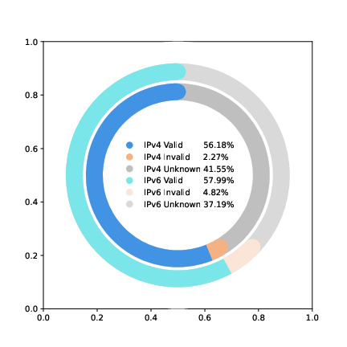

# Hecate -- From Unknown to Known: Enhancing BGP Route Origin Validation with Multi-Source Data

## The latest validation results

### Comparison of CRO Validation Results with RPKI ROA and IRR

### CRO Validation Results on the Global Routing Table

### ROA Validation Results on the Global Routing Table

### CRO sources

## Locations of the CRO Data

The CRO data is stored in the `data/cro.gz` and `cro_new.gz` 

## Description of the code structure

The repo contains the following directories:

