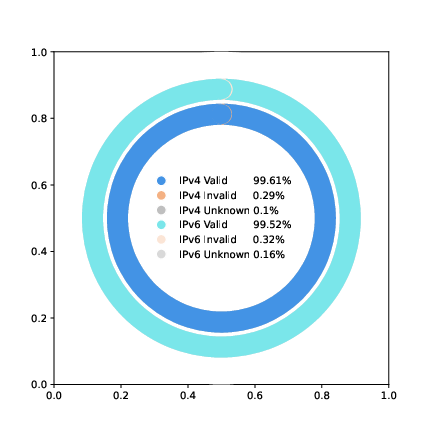
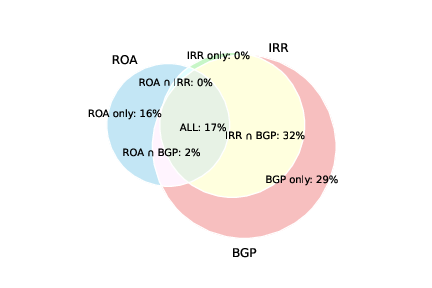

# Hecate -- From Unknown to Known: Enhancing BGP Route Origin Validation with Multi-Source Data

## The latest validation results

### Comparison of CRO Validation Results with RPKI ROA and IRR


### CRO Validation Results on the Global Routing Table



### ROA Validation Results on the Global Routing Table


### CRO sources



## Locations of the CRO Data

The CRO data is stored in the `data/cro.gz` and `cro_new.gz` 

## Description of the code structure

The repo contains the following directories:

### Requirements

Routinator: https://routinator.docs.nlnetlabs.nl/en/stable/index.html#

Python3: https://www.python.org/downloads/

Python3 packages: tqdm, numpy, pandas, matplotlib_venn

bgpdump:
```
For Ubuntu

sudo apt update
sudo apt install bgpdump
```


### Workflow

```
git clone https://github.com/wonajec2701/hecate.git
# if you cannot clone, please try:
# git clone --depth 1 https://github.com/wonajec2701/hecate.git
# git fetch --unshallow
mkdir /home/demo # adduser demo 
```

#### For daily CRO:
```
mv hecate/code/multi_source_data /home/demo/multi_source_data
# please replace YOUR_PASSWORD with your actual password below.
sed -i '5s/password=""/password="YOUR_PASSWORD"/' demo_start_bgp_roa.sh
```

##### If you have local private record:
Put your record at:
```
ipv4 record: /home/demo/multi_source_data/YYYY-MM-DD/bgp_route/parsed-rib-ipv4
ipv6 record: /home/demo/multi_source_data/YYYY-MM-DD/bgp_route/parsed-rib-ipv6
```
Format:
``` 
ASN Prefix
E.g. 13335 1.0.0.0/24
```

```
crontab -e
```
add next commands:
```
20 0 * * * /home/demo/multi_source_data/demo_start_bgp_roa.sh
10 1 * * * /home/demo/multi_source_data/demo_start_irr.sh
```

Daily CRO File: 
```
/home/demo/multi_source_data/cro_data/cro_new_initial.json
/home/demo/multi_source_data/cro_data/cro_new.json
```

#### For local routes validation (Should generate daily CRO first):
```
mv hecate/code/route_analyze /home/demo/route_analyze
```

##### Three files from your own local routers:
1.current-total-with-path

All BGP updates periodically (every five minutes in our paper)

Format:
``` 
YYYY-MM_DD HH:MM:SS.ffffff ASN Prefix validation-result [AS-PATH]
E.g. 2025-08-13 07:22:49.255896 25773 66.22.3.0/24 valid [xxxx 1xxx 198949 25773] 
```

2.YYYY-MM-DD/parsed-rib-ipv4

Daily local rib with ipv4 routes

Format:
``` 
ASN Prefix router-result
E.g. 13335 1.0.0.0/24 valid
```

3.YYYY-MM-DD/parsed-rib-ipv6

Daily local rib with ipv6 routes

Format:
``` 
ASN Prefix router-result
E.g. 18259 2001:218:2200::/40 valid
```

##### Run

```
crontab -e
```
add next commands:
```
0 3 * * * /home/demo/route_analyze/demo_local.sh
```

```
python3 pipeline_route_retification_new.py 
```

